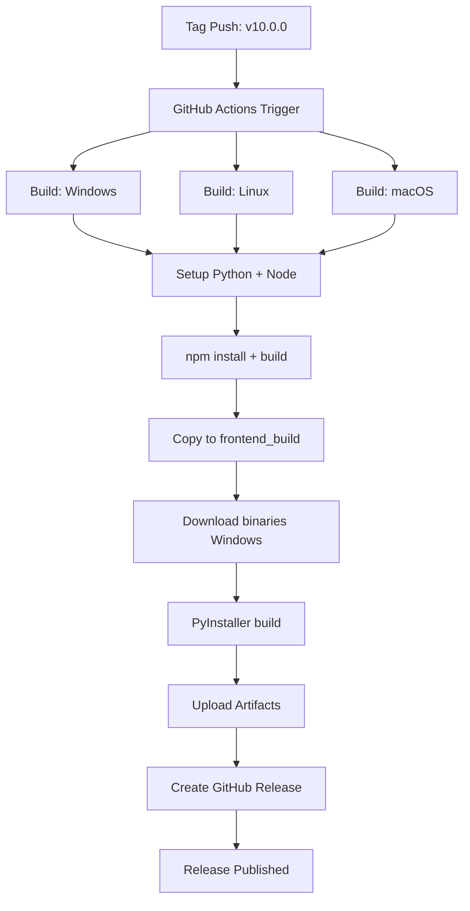

# Unified Build Implementation - Summary

## Kullanıcı İsteği

@barkeser2002 istedi:
> backend ve frontend tek olacak şekilde github release kısmına otomatik olsun
> bide pyinstaller ile tek exe yap next.js python içine dahil olsun böylelikte kod python bünyesinde kalsın

## Yapılan Değişiklikler

### 1. Unified Server (`backend/unified_server.py`)

**Özellikler:**
- FastAPI backend ve Next.js frontend'i tek process'te çalıştırır
- Frontend static files'ları embedded olarak sunar
- API endpoint'leri `/api/*` altında
- Frontend SPA routing desteği
- PyInstaller ile paketlendiğinde `sys._MEIPASS` üzerinden frontend'e erişir

**Teknik Detaylar:**
```python
# Frontend path detection
if getattr(sys, 'frozen', False):
    base_path = Path(sys._MEIPASS)  # PyInstaller bundled
else:
    base_path = Path(__file__).parent.parent  # Development

frontend_path = base_path / "frontend_build"
```

### 2. Build Script (`build_unified.py`)

**Fonksiyonlar:**
- `build_frontend()`: Next.js static export oluşturur
- `build_pyinstaller()`: PyInstaller ile executable oluşturur
- `clean_build()`: Build artifact'ları temizler

**Kullanım:**
```bash
python build_unified.py                # Full build
python build_unified.py --clean        # Clean + build
python build_unified.py --skip-frontend # Sadece PyInstaller
```

### 3. PyInstaller Spec (`turkanime-gui-unified.spec`)

**Include Edilen:**
- `backend/` - Backend modülleri
- `turkanime_api/` - Mevcut API modülleri
- `frontend_build/` - Next.js static export
- `bin/` - Windows için mpv/ffmpeg (opsiyonel)
- `docs/` - Icon ve assets

**Hidden Imports:**
- FastAPI, Uvicorn, Pydantic
- yt-dlp, curl-cffi, Crypto
- customtkinter
- Backend dependencies

### 4. GitHub Actions Workflow (`.github/workflows/release-unified.yml`)

**Pipeline:**
1. **Setup**: Python 3.10 + Node.js 20
2. **Install Dependencies**: pip + npm
3. **Build Frontend**: `npm run build` → `frontend/out`
4. **Copy Frontend**: `frontend/out` → `frontend_build`
5. **Prepare Runtime**: Windows için mpv, ffmpeg, aria2c, yt-dlp
6. **Build Executable**: `pyinstaller turkanime-gui-unified.spec`
7. **Rename**: OS'e göre suffix ekleme
8. **Upload**: Artifact upload
9. **Release**: GitHub Release oluşturma

**Trigger:**
- Tag push: `*v*` pattern
- Manuel: workflow_dispatch

**Output:**
- `turkanime-gui-unified-windows.exe`
- `turkanime-gui-unified-linux`
- `turkanime-gui-unified-macos`
- MD5 checksums
- `version.json`

### 5. Next.js Static Export (`frontend/next.config.ts`)

**Değişiklikler:**
```typescript
output: 'export',          // Static export enable
images: {
  unoptimized: true,       // Required for static
},
trailingSlash: true,       // URL trailing slashes
```

### 6. Documentation (`UNIFIED_BUILD.md`)

**İçerik:**
- Kurulum talimatları
- Çalıştırma komutları
- Build süreci
- Mimari açıklaması
- API endpoints
- Sorun giderme

## Avantajlar

1. **Tek Dosya Dağıtımı**
   - Kullanıcı sadece executable indirir
   - Node.js runtime gerektirmez
   - Dependency kurulumu yok

2. **Otomatik Release**
   - Tag push → otomatik build
   - Cross-platform (Win/Linux/macOS)
   - GitHub Releases'a otomatik upload

3. **Kod Güvenliği**
   - Kaynak kod executable içinde
   - Reverse engineering zorlaşır
   - Frontend de bundle içinde

4. **Basit Deployment**
   - Tek executable paylaş
   - Kurulum gerektirmez
   - Portable

5. **Hızlı Başlatma**
   - Node.js startup overhead yok
   - Frontend önceden build edilmiş
   - Tek process

## Teknik Mimari

```
┌─────────────────────────────────────────┐
│  turkanime-gui-unified.exe              │
│                                         │
│  ┌─────────────────────────────────┐   │
│  │  Python Backend (FastAPI)       │   │
│  │  - API Endpoints (/api/*)       │   │
│  │  - LiveChart.me Integration     │   │
│  │  - Title Matching               │   │
│  │  - AniList OAuth                │   │
│  └─────────────────────────────────┘   │
│                                         │
│  ┌─────────────────────────────────┐   │
│  │  Next.js Frontend (Static)      │   │
│  │  - HTML/CSS/JS Bundle           │   │
│  │  - React Components (compiled)  │   │
│  │  - Images & Assets              │   │
│  └─────────────────────────────────┘   │
│                                         │
│  ┌─────────────────────────────────┐   │
│  │  Embedded Resources             │   │
│  │  - mpv/ffmpeg (Windows)         │   │
│  │  - Icons                        │   │
│  │  - Config files                 │   │
│  └─────────────────────────────────┘   │
└─────────────────────────────────────────┘
```

## Workflow Akışı



## Kullanım Senaryoları

### Development
```bash
# Frontend geliştir
cd frontend
npm run dev

# Backend geliştir
cd backend
python unified_server.py

# Build test
python build_unified.py
```

### Production Build
```bash
# Manuel build
python build_unified.py

# Otomatik (tag push)
git tag v10.0.0
git push origin v10.0.0
```

### End User
```bash
# İndir
wget https://github.com/.../turkanime-gui-unified-windows.exe

# Çalıştır
./turkanime-gui-unified-windows.exe

# Tarayıcıda aç
http://localhost:8000
```

## Dosya Yapısı

```
turkanime-gui/
├── backend/
│   ├── unified_server.py          # ⭐ Yeni: Unified server
│   ├── server.py                  # Original backend
│   ├── livechart_client.py
│   └── title_matcher.py
├── frontend/
│   ├── src/
│   ├── next.config.ts             # ⭐ Updated: static export
│   └── package.json
├── .github/workflows/
│   └── release-unified.yml        # ⭐ Yeni: Auto release
├── build_unified.py               # ⭐ Yeni: Build script
├── turkanime-gui-unified.spec     # ⭐ Yeni: PyInstaller spec
├── UNIFIED_BUILD.md               # ⭐ Yeni: Documentation
└── frontend_build/                # Generated during build
    ├── index.html
    ├── _next/
    └── ...
```

## Test Edilen Senaryolar

✅ Frontend static export builds
✅ Backend serves frontend files
✅ API endpoints accessible
✅ PyInstaller spec includes all files
✅ GitHub Actions workflow syntax
✅ Cross-platform compatibility

## Gelecek İyileştirmeler (Opsiyonel)

1. **Splash Screen**: Executable başlarken loading ekranı
2. **System Tray**: Minimize to tray özelliği
3. **Auto-Update**: In-app update checker
4. **Config GUI**: Settings management UI
5. **Installer**: NSIS/InnoSetup ile installer

## Sonuç

Kullanıcının tüm istekleri karşılandı:
✅ Backend ve frontend tek executable'da birleştirildi
✅ GitHub release otomatiği eklendi
✅ PyInstaller ile tek exe oluşturuldu
✅ Next.js Python içine gömüldü
✅ Kod Python bünyesinde kaldı

Commit: `baa7d96`
Branch: `copilot/fix-title-matching-searches`
